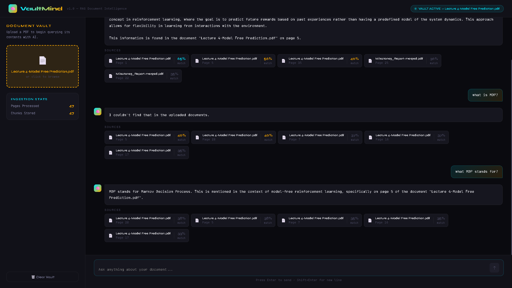
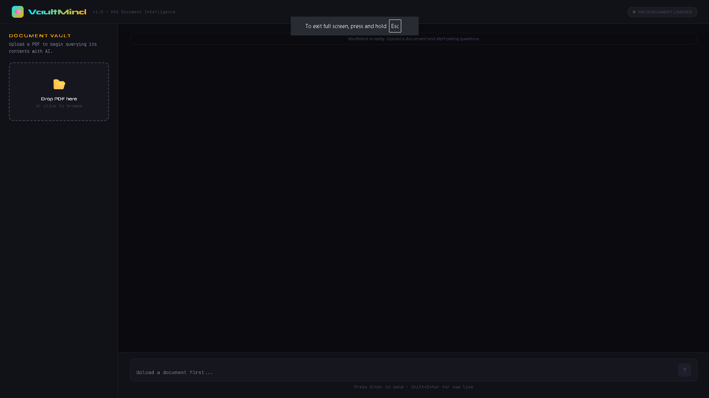
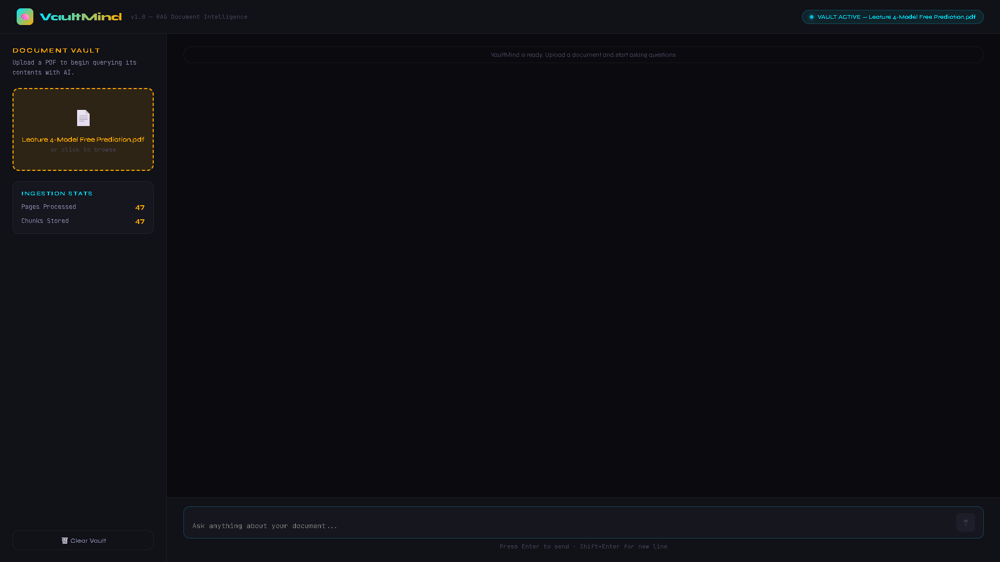

# 🧠 VaultMind — RAG Document Intelligence

> Upload documents. Ask anything. Get answers with sources.

VaultMind is an AI-powered document Q&A application built with a clean RAG (Retrieval-Augmented Generation) pipeline — no LangChain, no bloat. Just direct OpenAI API + ChromaDB + FastAPI + React.



---

## ✨ Features

| Feature | Description |
|---|---|
| 📄 **Multi-format Upload** | Upload PDF, DOCX, and TXT files |
| 🔍 **RAG-Powered Q&A** | Ask natural language questions, get answers with page-level source citations |
| 🧠 **Conversation History** | Follow-up questions work naturally — VaultMind remembers the conversation |
| 📋 **Document Summarization** | One-click AI summary with overview, key topics, findings, and document type |
| 💡 **Smart Query Suggestions** | Auto-generates 3 relevant questions after every upload |
| 🗂️ **Multi-Document Vault** | Upload and query across multiple documents simultaneously |
| 🗑️ **Document Manager** | Delete individual documents or clear the entire vault |
| ✍️ **Markdown Rendering** | Answers render with bold, bullets, headers, and code formatting |
| ↓ **Chat Export** | Download full conversation as a `.md` file |
| ⚡ **Local Vector Store** | ChromaDB persists embeddings on disk — no external vector DB needed |

---

## 📸 Screenshots

### Empty State — Ready to Upload


### Vault Active — Document Uploaded with Smart Suggestions


### Chat with Answer, Sources & Markdown Rendering


---

## 🏗️ Architecture

```
PDF/DOCX/TXT Upload
        ↓
Text Extraction (PyPDF / python-docx / plain text)
        ↓
Token-aware Chunking (tiktoken, 500 tokens + 50 overlap)
        ↓
OpenAI Embeddings (text-embedding-3-small)
        ↓
ChromaDB Vector Store (local persistent)
        ↓
User Question → OpenAI Embeddings → Cosine Similarity Search
        ↓
Top-K Chunks → Context Assembly → GPT-4o-mini
        ↓
Answer + Source Citations + Conversation History
```

---

## 🛠️ Tech Stack

| Layer | Technology |
|---|---|
| **Embeddings** | OpenAI `text-embedding-3-small` |
| **LLM** | OpenAI `gpt-4o-mini` |
| **Vector Store** | ChromaDB (local persistent, cosine similarity) |
| **PDF Parsing** | PyPDF |
| **DOCX Parsing** | python-docx |
| **Chunking** | tiktoken (token-aware, 500 tokens + 50 overlap) |
| **Backend API** | FastAPI + Uvicorn |
| **Frontend** | React + Vite |
| **HTTP Client** | Axios |
| **Markdown** | react-markdown |
| **Environment** | Conda (Python 3.11) |

> ⚡ No LangChain — built directly on OpenAI API and ChromaDB for full control and simplicity.

---

## 📁 Project Structure

```
VaultMind/
├── vaultmind/
│   ├── ingest/
│   │   ├── pdf_loader.py       ← PDF text extraction
│   │   ├── text_loader.py      ← TXT and DOCX extraction
│   │   ├── chunker.py          ← Token-aware chunking
│   │   └── embedder.py         ← OpenAI embeddings (batched)
│   ├── store/
│   │   └── chroma_store.py     ← ChromaDB add/query operations
│   ├── query/
│   │   └── retriever.py        ← Embedding query + similarity search
│   ├── llm/
│   │   └── openai_client.py    ← RAG answer generation with history
│   └── api/
│       └── main.py             ← FastAPI routes
├── frontend/                   ← React + Vite UI
│   └── src/
│       ├── components/
│       │   ├── UploadPanel.jsx ← Document vault + suggestions
│       │   ├── ChatPanel.jsx   ← Chat interface + export
│       │   └── SourceCard.jsx  ← Source citation cards
│       ├── App.jsx
│       └── index.css
├── uploads/                    ← Uploaded documents stored here
├── chroma_db/                  ← ChromaDB vector store (local)
├── assets/                     ← Screenshots
├── test_pipeline.py            ← CLI end-to-end test
├── .env.example                ← Environment template
├── environment.yml             ← Conda environment
└── requirements.txt
```

---

## ⚙️ Setup & Installation

### Prerequisites
- Python 3.11+
- Anaconda or Miniconda
- Node.js 18+
- OpenAI API key

### 1. Clone the repo

```bash
git clone https://github.com/DoshiTirth/VaultMind.git
cd VaultMind
```

### 2. Create the conda environment

```bash
conda create -n vaultmind python=3.11 -y
conda activate vaultmind
```

### 3. Install Python dependencies

```bash
conda install -c conda-forge numpy=1.26 -y
pip install -r requirements.txt
```

### 4. Set up environment variables

```bash
cp .env.example .env
```

Open `.env` and add your OpenAI API key:

```
OPENAI_API_KEY=sk-your-key-here
```

### 5. Install and run the frontend

```bash
cd frontend
npm install
npm run dev
```

### 6. Run the backend (separate terminal)

```bash
conda activate vaultmind
uvicorn vaultmind.api.main:app --reload
```

### 7. Open the app

```
http://localhost:5173
```

---

## 🚀 Usage

1. **Upload a document** — drag and drop or click the upload zone (PDF, DOCX, or TXT)
2. **Review suggestions** — VaultMind auto-generates 3 smart questions about your document
3. **Ask questions** — type any natural language question or click a suggestion
4. **Review sources** — each answer shows source cards with file name, page number, and match score
5. **Summarize** — click ✦ Summarize on any document for a structured AI summary
6. **Export** — click ↓ Export Chat to download the conversation as a `.md` file

---

## 📡 API Endpoints

| Method | Endpoint | Description |
|---|---|---|
| `GET` | `/` | Health check |
| `POST` | `/upload` | Upload and ingest a PDF, DOCX, or TXT file |
| `POST` | `/query` | Ask a question with conversation history |
| `GET` | `/documents` | List all uploaded documents |
| `GET` | `/summarize/{filename}` | Generate AI summary for a document |
| `GET` | `/suggestions/{filename}` | Get 3 suggested questions for a document |
| `DELETE` | `/documents/{filename}` | Delete a single document |
| `DELETE` | `/clear` | Clear all documents from the vault |

---

## 🔑 Environment Variables

| Variable | Description | Default |
|---|---|---|
| `OPENAI_API_KEY` | Your OpenAI API key | required |
| `CHROMA_DB_PATH` | Path to ChromaDB storage | `./chroma_db` |
| `UPLOAD_DIR` | Path to uploads folder | `./uploads` |
| `EMBED_MODEL` | OpenAI embedding model | `text-embedding-3-small` |
| `CHAT_MODEL` | OpenAI chat model | `gpt-4o-mini` |

---

## 👤 Author

**Tirth Doshi**
- GitHub: [@DoshiTirth](https://github.com/DoshiTirth)
